## Architecture Summary

__Core Domain & Strategy:__ Domain-Driven Design (DDD) focusing on bounded contexts, explicit domain models, and ubiquitous language tailored for video file processing workflows.

__Architecture Style:__ Event-Driven Architecture (EDA) for asynchronous, decoupled communication and scalable handling of file state transitions.

__Reliability Pattern:__ Transactional Outbox Pattern to ensure atomic operations between PostgreSQL database updates and reliable event dispatching.

__Container Orchestration:__ Kubernetes (k8s) cluster hosting the microservices/application workloads, managing auto-scaling, deployment, secret management, and high availability across processing nodes.

__Data Persistence:__ PostgreSQL serving as the primary relational database and outbox storage.

__Internal Event Bus:__ RabbitMQ acting as the message broker for service-to-service asynchronous communication.

__Storage Infrastructure:__ AWS S3 bucket dedicated to hosting large video assets (handling payloads exceeding 400 GB).

__AWS Integration:__ AWS SQS queue consuming S3 event notifications (e.g., file upload, multi-part state changes) and feeding file state updates into the application.

## System Integration Blueprint

```mermaid
architecture-beta

    group aws(cloud)[AWS clouds]
        service s3(logos:aws-s3)[S3 backet] in aws
        service sqs(logos:aws-sqs)[SQS] in aws



    group cluster(logos:aws-eks)[Cluster]
        service listener(logos:aws-sqs)[AWS SQS Listener] in cluster
        service domain (logos:appbase)[Domain service] in cluster
        service db(database)[PostgreSql] in cluster
        service outbox (logos:appbase)[Outbox Publisher] in cluster
        service rabbit(logos:aws-sqs)[RabbitMQ] in cluster
        service agents(logos:aws-eks)[Processing Worker Pods] in cluster

    listener:R --> L:domain
    domain:B --> T:db
    db:R --> L:outbox
    outbox:B --> T:rabbit
    rabbit:B --> T:agents 

    s3:R --> L:sqs
    sqs:R --> L:listener   

```




## Context diagram

```mermaid


```